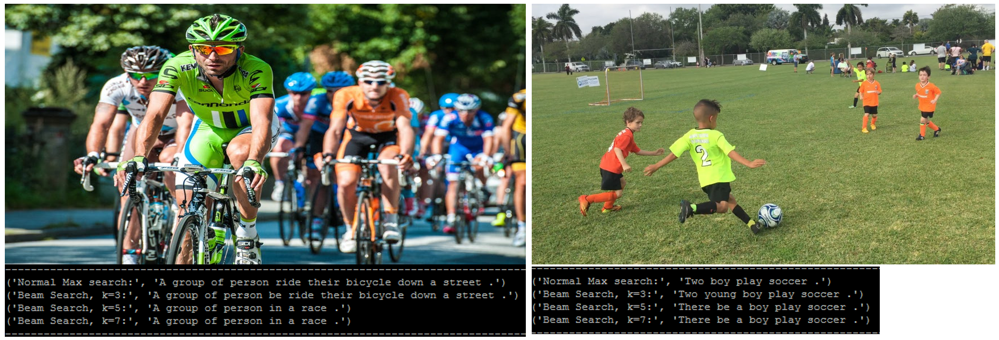

# Image Captioning using CNN and LSTMs
An implementation of image captioning


First complete preprocessing to generate the tokens.
```
python preprocessing.py 
```
For training and testing: 
The train file will save model in the directory as well.
```
python train.py
python eval.py
```

Sample results on random images from google


